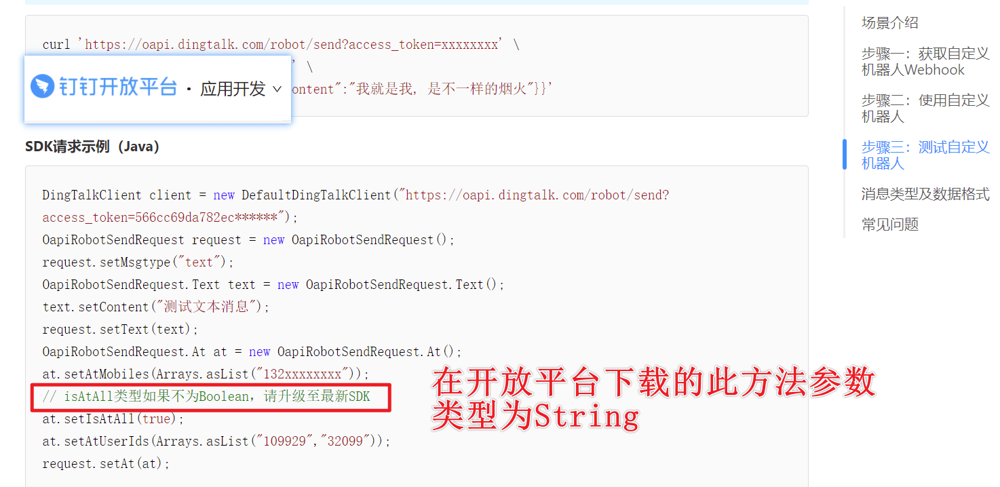
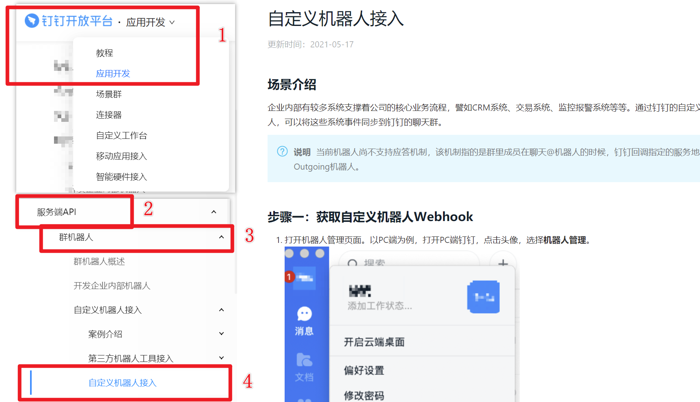

# dingtalk_developers

dingtalk_developers项目 是对 钉钉开放平台 API功能的学习及测试使用。

# 1 在钉钉群中添加自定义机器人

```sh
##1. 点击头像-->机器人管理-->自定义-->添加-->输入一个关键字-->添加完成就会生成如下的令牌

https://oapi.dingtalk.com/robot/send?access_token=你的令牌

##2. 测试
curl 'https://oapi.dingtalk.com/robot/send?access_token=你的令牌' \
-H 'Content-Type: application/json' \
-d '{"msgtype":"text", "text":{"content":"关键词-String"}}'
```

# 2 依赖maven

~~在使用钉钉前，需要先向本地maven仓库中导入钉钉所需的SDK。~~

## ~~2.1 下载钉钉服务店SDK~~

~~[服务端SDK下载 - 钉钉开放平台 (dingtalk.com)](https://developers.dingtalk.com/document/app/download-the-server-side-sdk)~~

## ~~2.2 将钉钉的sdk安装到maven的本地仓库~~

~~需要在cmd界面执行，需要配置maven的bin目录在path路径下。~~

```sh
mvn install:install-file -Dfile=D:/development/Jars/taobao-sdk-java-auto_1479188381469-20210709.jar -DgroupId=com.dingtalk -DartifactId=dingtalk-api -Dversion=1.0.0 -Dpackaging=jar
```

## ~~2.3 导入dingtalk依赖~~

```xml
<!-- dingtalk依赖 -->
<dependency>
    <groupId>com.dingtalk</groupId>
    <artifactId>dingtalk-api</artifactId>
    <version>1.0.0</version>
    <scope>compile</scope>
</dependency>

<dependency>
    <groupId>commons-logging</groupId>
    <artifactId>commons-logging</artifactId>
    <version>1.2</version>
</dependency>
```

## 2.1 导入阿里云仓库中的DingTalk SDK

不知道是什么原因，官网上下载的jar包竟然不是最新版的。



故直接更改了pom文件去下载阿里云仓库中的sdk了。

# 3 自定义预警机器人

[自定义机器人接入 - 钉钉开放平台 (dingtalk.com)](https://developers.dingtalk.com/document/app/custom-robot-access)



